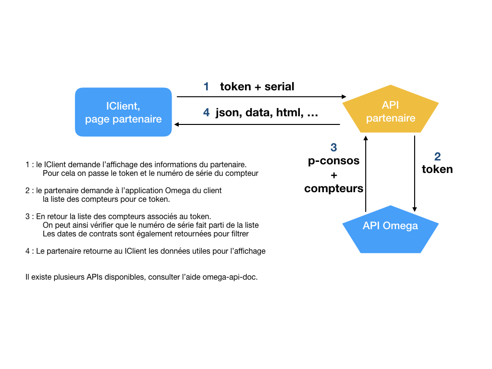

Documentation IClient - Portail abonnés
---

# Présentation

Le IClient ou portail abonnés permet de mettre à disposition aux abonnés d'un service des eaux un espace de consultation. Cet espace reprend les principales informations des différents contrats de l'abonné. L'abonné y retrouve ses coordonnées, relevés, factures, ... et peut aussi effectuer certaines démarches en ligne.

Les informations y figurant sont liées à la facturation Omega et n'englobent pas de données spécifiques à certains métiers comme la relève, l'assainissement, ...

Pour étendre les informations mises à disposition de l'abonné et dans un souci de lui faciliter et réduire le nombre de connexions, nous pouvons réserver une ou plusieurs pages à un partenaire.

# Techniquement

Le Iclient est une application "Full Javascript" qui communique avec un "Backoffice" via services web. La sécurisation entre les deux parties est effectuée à l'aide d'un token "JWT". Il est possible d'ajouter sous forme de module ou extension des éléments javascript. En effet, certain ponts sont accessibles si on suit et respecte certaines règles :

* Une classe spécifique doit être mise à disposition. Cette [classe](./JvsPartnerReleve.js) sera étendue de notre côté en fonction des besoins. La version en lien permet d'avoir un exemple d'utilisation.
* Le design principal a été réalisé en bootstrap 4, responsive sur principalement 5 tailles. Vous trouverez [ici](./btvars.md) les différentes variables bootstrap modifiées. Il suffit de respecter les classes bootstrap en prenant en compte que l'on est passé en 36 colonnes au lieu de 12.
* Assurer que l'abonné connecté ne peut voir que ses propres données en vérifiant avec nos APIs les tokens, ...

Un seul fichier sera utilisable mais peut bien entendu être livré sous forme de bundle dans le cas d'un module (react, angular, ember, ...)

# Déploiement

Il existe principalement 2 cas. Le fichier js est déployé directement sur les serveurs (via un cycle de pré production) ou intégré dans le processus de génération du kit client.

Dans le premier cas c'est le partenaire qui s'occupe du module, des tests, de la vérification et de la sécurisation. Le module sera mis à disposition du client commun pour vérificarion et mise en production. Il devra également s'assurer de ne pas impacter le visuel courant du portail.

Dans le second cas la création graphique sera prise en charge par le pôle eau de JVS-Mairistem pour intéroger des services web du partenaire. Dans ce cas le processus de déploiement sera géré par le pôle Eau. A charge au partenaire de garantir la disponibilité de ses services.

# Fonctionnement en détail

## Cinétatique attendue



Un client PHP et/ou Java pourra être mis à disposition pour ces échanges.

Le code Javascript de base est récupérable dans ce repository dans le fichier **JvsPartnerReleve.js**

## Design

Comme précisé, c'est bootstrap 4 qui est utilisé avec 36 colonnes par ligne. Les thèmes sont adaptés ainsi que les couleurs des différents éléments boostrap. Le css est accessible pour tous donc merci de ne pas surcharger avec des css personnels pour éviter tout risque.

## Phase 1 : initialisation

La première phase consiste à initialiser l'objet, pour celà il existe la méthode :

```
/**
 * Initialisation
 *
 * @see IClient\V1\Basic\Releve
 *
 * Tout traitement d'initialisation, premier chargement
 *
 * @return void
 */
this.init = function ()
{
  // @todo spécial init....
  // ...
}
```

On peut tester la connectivité service web, ...

## Phase 2 : mise à jour des infos

```
/**
 * Config update
 *
 * @see IClient\V1\Basic\Releve
 *
 * Méthode appelée à chaque changement sur une variables,
 * déconnexion, changement de contrat, ...
 *
 * @return void
 */
this.updateConfig = function (key, value) {
  this.config[key] = value;
  // ...
}
```

Appelé si l'abonné change de contrat, se déconnecte, ...

## Phase 3 : demande d'affichage

```
/**
 * Render display
 *
 * @see IClient\V1\Basic\Releve
 *
 * Il sera possible via une connexion server <> server de retourner la liste
 * des compteur liés au token, donc à l'abonné. Dans cette liste il suffira d'extraire les données
 * du compteur identifié par serial et prendre en compte les dates de contrats retournées.
 * Pour cette phase il est conseillé de faire une requête à notre serveur via le token pour contrôler
 * que le compteur est bien lié à ce dernier. Consulter la documentation "jvs-groupe/omega-api-doc"
 *
 * @return void
 */
this.render = function () {
  // ...
}
```

Rafraichissement des données.

## Objets disponibles

On injecte dans la classe, donc accessible via this. :

Des modules :

* jQuery
* moment
* chartJs

Des méthodes :

* loadingOn, pour afficher l'animation d'attente
* loadingOff, pour couper l'animation d'attente

Un logger :

* logger, qui alimente l'ELK du pole Eau.
  - avec les méthodes debug, info, error, critical
